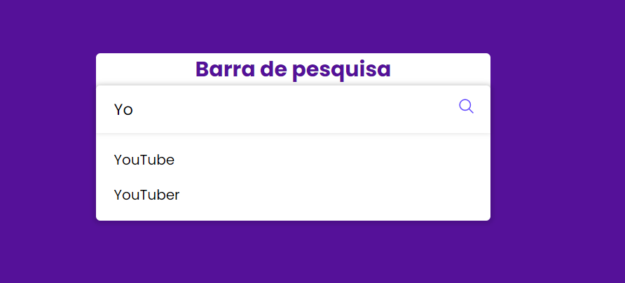

# BUSCADOR AUTOCOMPLETE
💬FORMULÁRIO BUSCADOR COM SUGESTÃO!

  

  

## DESCRIÇÃO:
Este é um código HTML e JavaScript que cria uma barra de pesquisa com funcionalidade de autocompletar. Vamos dividi-lo em seções para entender melhor:

### Parte HTML:
1. **DOCTYPE e HTML Tag:**
   - `<!DOCTYPE html>`: Define o tipo de documento como HTML5.
   - `<html lang="pt-BR">`: Define o início do documento HTML e especifica o idioma como português do Brasil.

2. **Head Section:**
   - Configuração de metadados, título da página, link para uma folha de estilo externa (`style.css`), configuração de viewport e inclusão de scripts para ícones Ionicons.

3. **Body Section:**
   - Contém uma estrutura de barra de pesquisa com um campo de entrada (`input`), uma lista de sugestões (`list`), um ícone de pesquisa e links para scripts externos (`sugestoes.js` e `script.js`).

### Parte JavaScript (`script.js`):
1. **Seleção de Elementos do DOM:**
   - `const searchWrapper`, `inputBox`, `sugestBox`, `icon`, `linkTag`: Seleciona elementos do DOM para manipulação no script.

2. **Manipulação do Evento de Digitação (`onkeyup`):**
   - Ao digitar na barra de pesquisa, o script filtra sugestões com base no que o usuário digita.
   - Se a tecla Enter for pressionada, ele abre uma nova guia do navegador com uma pesquisa no Google.
   - Se a tecla Escape for pressionada, ele oculta a caixa de autocompletar.

3. **Função `select`:**
   - Seleciona uma sugestão da lista e preenche o campo de entrada com ela.
   - Ao clicar no ícone de pesquisa, abre uma nova guia do navegador com uma pesquisa no Google usando a sugestão selecionada.

4. **Função `showSuggestions`:**
   - Exibe as sugestões na lista de autocompletar.

### Parte CSS (`style.css`):
1. **Estilo Geral:**
   - Configura o estilo global, como margens, preenchimentos e configuração da fonte Poppins do Google Fonts.

2. **Estilo da Barra de Pesquisa:**
   - Define estilos para a barra de pesquisa, como altura, largura, borda, sombra e cor de fundo.

3. **Estilo da Lista de Sugestões:**
   - Configura a aparência da lista de sugestões quando exibida, incluindo margens, opacidade e borda.

4. **Estilo dos Itens da Lista de Sugestões:**
   - Define estilos para os itens da lista, como preenchimento, borda, cursor e cor de fundo ao passar o mouse.

5. **Estilo do Ícone de Pesquisa:**
   - Configura o estilo do ícone de pesquisa, incluindo posição, altura, largura, alinhamento e cor.

### Parte de Dados (Array de Sugestões):
   - Um array chamado `suggestions` contém palavras sugeridas para autocompletar, como "Canal", "YouTube", "Dev Sandrin", etc.

Este código cria uma barra de pesquisa interativa que fornece sugestões à medida que o usuário digita, e ao selecionar uma sugestão, ele pode clicar no ícone de pesquisa para realizar uma busca no Google.